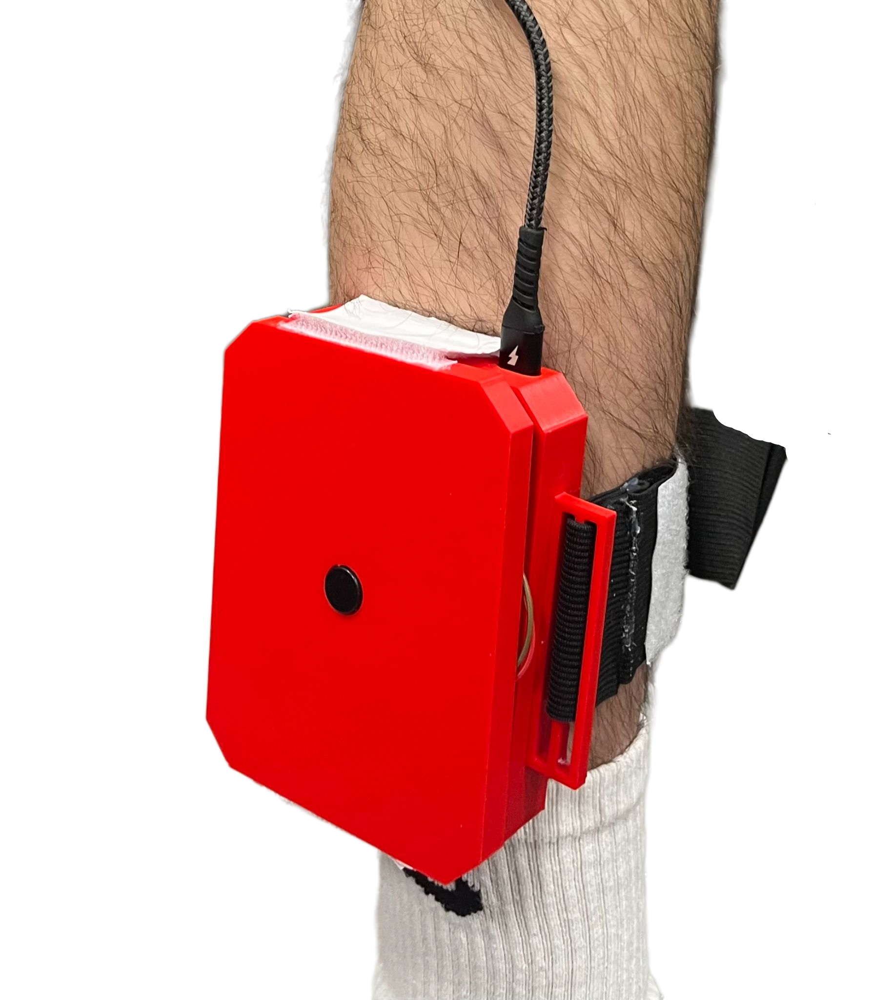

# 🐮 Sistema IoT de Análisis de Marcha y Detección de Patologías

> *"Un Guardián Digital para el bienestar animal."*  
> Proyecto final de la asignatura **Electrónica Digital y Microcontroladores** - Universidad Loyola Andalucía.

---

## 📖 Descripción

Este proyecto consiste en un **dispositivo wearable** diseñado para la detección temprana de cojeras y fiebre en ganado y caballos. A diferencia de la observación visual tradicional, que suele detectar problemas cuando ya son graves, este sistema utiliza **Edge Computing** para analizar patrones de movimiento en tiempo real directamente en el dispositivo.

El sistema se coloca en el gemelo del animal y procesa datos de acelerometría y temperatura para identificar **anomalías biomecánicas** (cambios en la pisada, impactos irregulares) antes de que se conviertan en lesiones críticas.

---

## 🚀 Características Principales

- **Detección de Cojera en el Borde (Edge AI)**: Algoritmo estadístico integrado que calcula la variabilidad de la marcha en tiempo real sin necesidad de conexión a la nube.

- **Análisis Biomecánico Completo**:
  - Cadencia (pasos/segundo).
  - Energía de impacto.
  - Suavidad del movimiento (Jerk).
  - Fases de la marcha (apoyo vs. vuelo).

- **Autocalibración**: Rutina de inicio que elimina el drift y calcula el bias de los sensores MEMS automáticamente.

- **Termometría IR**: Monitorización de temperatura muscular no invasiva con compensación de distancia.

- **Sistema Robusto**: Implementación de Watchdogs de software para reiniciar la comunicación serial en caso de saturación del buffer.

---

## 🛠️ Hardware (BOM)

| Componente | Descripción | Función |
|------------|-------------|---------|
| **ESP32-S3** | Microcontrolador Dual-Core | Cerebro del sistema, procesamiento de señales y gestión I2C. |
| **ICM-20948** | IMU 9-DoF (I2C) | Acelerómetro y Giroscopio de alta precisión. |
| **MLX90614** | Sensor IR (I2C) | Medición de temperatura corporal sin contacto. |
| **LiPo Battery** | 3.7V | Fuente de alimentación portátil. |
| **Carcasa 3D** | PLA/PETG | Protección física de la electrónica. |

---

## 🔌 Esquema de Conexión

El sistema utiliza el bus **I2C** para la comunicación con los sensores.

| Pin ESP32 | Conexión | Notas |
|-----------|----------|-------|
| **GPIO 5** | SDA | Línea de datos I2C |
| **GPIO 4** | SCL | Línea de reloj I2C |
| **3V3** | VCC | Alimentación sensores |
| **GND** | GND | Tierra común |

> **Nota**: Las direcciones I2C son gestionadas por el firmware. Asegúrate de que los pull-ups del bus I2C sean adecuados si usas cables largos.

---

## 🧠 Arquitectura de Software y Algoritmos

El firmware está escrito en **C++** y destaca por realizar todo el procesamiento matemático en el propio microcontrolador (**Edge Computing**).

### 1. Detección de Eventos (Pasos)

Se utiliza un algoritmo de **umbrales dinámicos** con debouncing (anti-rebote) temporal para filtrar vibraciones mecánicas y detectar pasos reales.

- **Umbral de Impacto**: > 0.65g (desviación de la gravedad).
- **Ventana Temporal**: > 0.3s (filtro de frecuencia máxima de paso).

### 2. Detección Estadística de Cojera (Circular Buffer)

El núcleo de la detección de patologías. El sistema almacena los últimos 10 pasos en un **Buffer Circular** y calcula el **Coeficiente de Variación (CV)**.

$$CV = \frac{\sigma}{\mu}$$

Si $CV_{tiempo} > 25\%$ o $CV_{impacto} > 30\%$, el sistema activa la bandera `isLimping`.

### 3. Física del Movimiento

- **Jerk (Suavidad)**: Calculado como la derivada de la aceleración ($\Delta a / \Delta t$).
- **Integración de Ángulos**: Estimación de Pitch y Roll mediante integración numérica del giroscopio.

### 4. Robustez (Software Watchdog)

La función `checkSerialHealth()` monitorea el estado del buffer de salida cada segundo. Si detecta saturación (<16 bytes libres), reinicia la pila serial para evitar bloqueos críticos y garantizar la telemetría continua.

---

## 📊 Visualización de Datos

El código soporta **3 modos de salida**, seleccionables enviando caracteres por el puerto serial:

- **Modo Monitor ('M')**: Salida legible para humanos con alertas visuales (e.g., ⚠ COJERA).
- **Modo Plotter ('G')**: Formato optimizado para el Serial Plotter de Arduino IDE, permitiendo ver gráficas en tiempo real de impacto y ángulos.
- **Modo Processing ('P')**: Salida CSV cruda para integración con software de visualización 3D externo.

---

## 📸 Galería

<!-- Sube tus imágenes a una carpeta "img" o usa links externos y reemplaza las rutas abajo -->

| Prototipo Final |
|-----------------|
|  |

---

## 💿 Instalación y Uso

1. **Clonar el repositorio**:
```bash
   analisis_de_marcha.ino
```

2. **Abrir el proyecto**: Usar Arduino IDE o PlatformIO.

3. **Instalar dependencias**:
   - Adafruit MLX90614 Library
   - ICM_20948_SPI (o librería compatible SparkFun/Adafruit)

4. **Configurar Placa**: Seleccionar `ESP32S3 Dev Module`.

5. **Subir código**: Conectar vía USB y flashear.

> ⚠️ **Calibración**: Al encender, mantener el dispositivo quieto durante 5 segundos para que el algoritmo de autocalibración establezca el "cero" de los sensores.

---

## 👨‍💻 Autor y Créditos

- **Desarrollado por**: Fabrizio Michele Chiaramonte
- **Asignatura**: Electrónica Digital y Microcontroladores
- **Profesora**: Raquel Cañete Yaque
- **Institución**: Universidad Loyola Andalucía

---

## 📄 Licencia

Este proyecto es de código abierto. Siéntete libre de usarlo, modificarlo y mejorarlo
